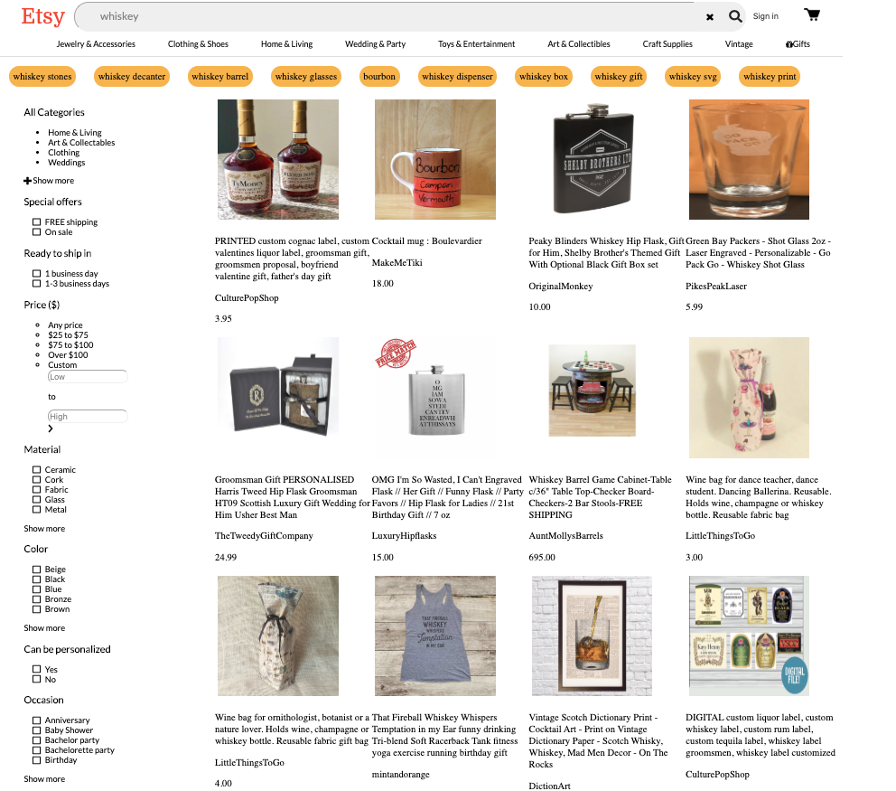

# Create Etsy Seach Page

## Challenges I Faced? 

Understanding how to navigate through Json data is quite a foggy concept. Also how that plays a role in the HTML and CSS seems a little esoteric at this current time. 

## How Did I Over Come Those Challenges? 

By Having the ability to do research on platforms like Google,YouTube, MDN docs, stackoverflow, GitHub, online courses, and reference guides. I was able to understand how to use Json data, As well as understand the role that it plays in HTML, CSS and Javascript. 

## What Did I Learn? 

* Received a deeper understanding of layout 
* How to understand and use string interpolation
* How to understand and use DOM Manipulation
* How to navigate through a large block of JSON data

